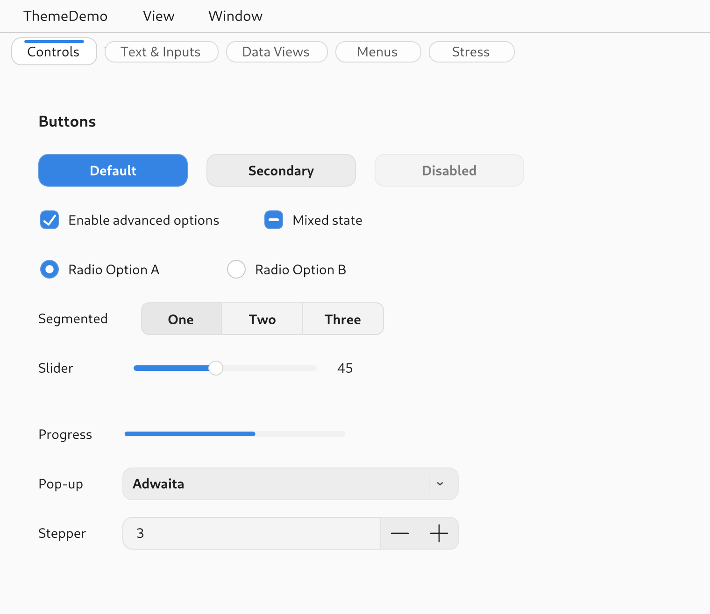
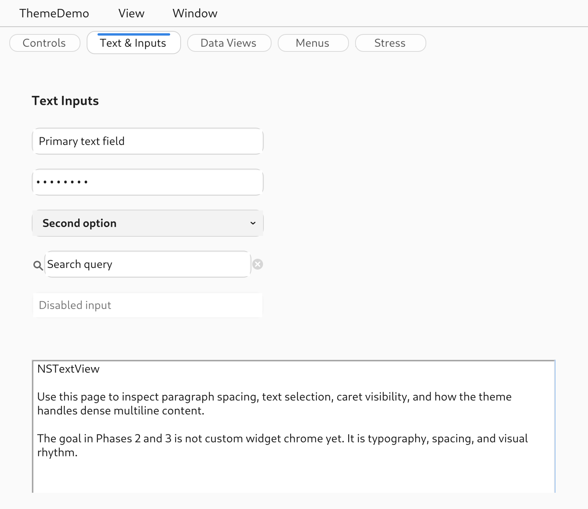
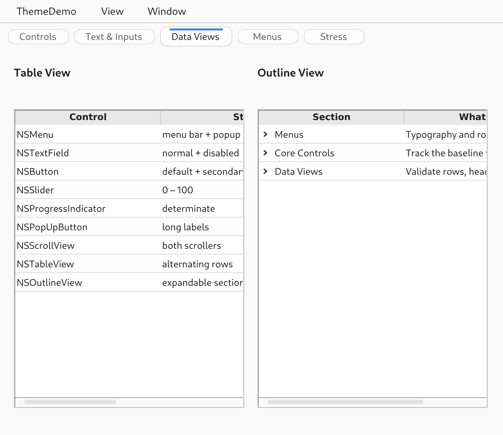

# GNUstep Adwaita Theme

`plugins-themes-adwaita` is an Adwaita-targeted theme plugin for GNUstep.

The goal is pragmatic rather than literal pixel-perfect GTK emulation: make
GNUstep applications feel at home on a modern GNOME desktop while staying
inside the GNUstep theme layer wherever possible.

The current priority is forward-looking GNOME integration, not strict backward
compatibility with the appearance of existing GNUstep applications. The main
use case today is making it possible to build new GNUstep apps that feel at
home on GNOME. Backward-compatibility improvements may still happen later, but
they are not the primary design constraint for this release.

## Screenshots

<p>
  
  
  
</p>

## Status

This project should currently be treated as an `0.1.0-alpha1` release.

What is already in place:

- Adwaita-inspired palette, spacing, and control rendering for core widgets
- A GNUstep demo app for side-by-side inspection
- A GTK4/libadwaita reference app for comparison
- GNOME settings integration for fonts and appearance variants

What is still known to be incomplete:

- text-field focus/render parity is not fully resolved yet
- some popup/combo-box interaction details still need manual polish
- visual acceptance is still partly manual rather than fully scripted

## Known Issues

- Focusing a text field can still cause a subtle text rendering change compared
  to the unfocused state.
- Combo-box and popup-menu interaction chrome is substantially improved, but a
  few interaction details still need final polish against the GTK reference.
- The project still relies on manual side-by-side visual review for some
  acceptance decisions.

## Scope

This theme targets stock Adwaita as the visual baseline for GNUstep on GNOME.

It does not currently aim to:

- support arbitrary third-party GTK themes
- reproduce GTK4's rendering architecture
- patch `libs-gui` unless a clear framework blocker remains after theme work
- guarantee that existing GNUstep applications will preserve their prior look
  unchanged under this theme

## Repository Layout

```text
Source/                  Theme implementation
Resources/               Theme bundle metadata and assets
Examples/ThemeDemo/      GNUstep-side demo app
Reference/AdwaitaDemo/   GTK4/libadwaita comparison harness
Tests/Scripts/           Capture and local verification helpers
Docs/                    Public design notes and roadmap
```

## Requirements

Build requirements for the GNUstep theme bundle:

- GNUstep make and GNUstep GUI development environment
- `pkg-config`
- `gio-2.0`
- `glib-2.0`
- `gobject-2.0`

Reference app requirements:

- Python 3
- PyGObject
- GTK4
- libadwaita

## Build

```sh
make
make -C Examples/ThemeDemo
```

Install the theme for the current user:

```sh
make install GNUSTEP_INSTALLATION_DOMAIN=USER
```

The installed theme bundle will be placed under:

```text
~/GNUstep/Library/Themes/Adwaita.theme
```

## Run

Launch the GNUstep demo app with the Adwaita theme selected:

```sh
PATH=/usr/GNUstep/System/Tools:$PATH defaults write ThemeDemo GSTheme Adwaita
bash Tests/Scripts/run-theme-demo.sh
```

Launch the GTK reference app:

```sh
python3 Reference/AdwaitaDemo/adwaita_demo.py
```

Open a specific page in the reference app:

```sh
python3 Reference/AdwaitaDemo/adwaita_demo.py --page controls
python3 Reference/AdwaitaDemo/adwaita_demo.py --page data
python3 Reference/AdwaitaDemo/adwaita_demo.py --page text
```

## Development Notes

The fastest practical review loop is:

```sh
make
make -C Examples/ThemeDemo
bash Tests/Scripts/run-theme-demo.sh --page controls
make check-quirks
```

The demo and capture scripts load the theme bundle built in this checkout
(`Adwaita.theme`, by absolute path), not the installed copy: `-GSTheme Adwaita`
finds `~/GNUstep/Library/Themes/Adwaita.theme`, which may be older. Pass
`--theme PATH` (or set `ADWAITA_THEME`) to check another build. Install for
other apps with `make install GNUSTEP_INSTALLATION_DOMAIN=USER`.

`make check-quirks` runs `Tests/Scripts/run-quirk-probe.sh`: it builds
`Examples/QuirkProbe` and runs it on a private Xvfb display against the built
theme. The probe renders controls offscreen and measures them (sized button and
checkbox titles, wrapping labels and alert text, toolbar image items, the bold
font, the menu bar in a window created after launch), prints one
PASS/FAIL/KNOWN/SKIP line per check, and exits with the number of failures.
KNOWN marks a GNUstep bug the theme can't fix (see `Docs/upstream-issues/`).
Add `--output DIR` to save a PNG of each probe window.

Useful helpers:

- `bash Tests/Scripts/run-theme-demo.sh`
- `bash Tests/Scripts/run-quirk-probe.sh --output /tmp/quirk-probe`
- `bash Tests/Scripts/run-adwaita-demo.sh`
- `bash Tests/Scripts/capture-theme-demo.sh --page controls --output /tmp/theme-controls.png`
- `bash Tests/Scripts/capture-adwaita-demo.sh --page controls --output /tmp/adwaita-controls.png`
- `python3 Reference/AdwaitaDemo/adwaita_demo.py --dump-metrics`

ThemeDemo also accepts command automation for focused visual checks:

```sh
Examples/ThemeDemo/ThemeDemo.app/ThemeDemo --command-script /tmp/theme-demo.commands
Examples/ThemeDemo/ThemeDemo.app/ThemeDemo --command-fifo /tmp/theme-demo.fifo
python3 Reference/AdwaitaDemo/adwaita_demo.py --command-script /tmp/adwaita-demo.commands
python3 Reference/AdwaitaDemo/adwaita_demo.py --command-fifo /tmp/adwaita-demo.fifo
```

Supported commands are `page NAME`, `click X Y`, `focus NAME`, `blur-to NAME`,
`select-all`, `open-dropdown NAME`, `type TEXT`, `key TEXT`, `wait SECONDS`,
`display`, `screenshot PATH`, `screenshot-screen PATH`,
`capture-dropdown NAME PATH`, `capture-alert PATH`, and `quit`. Text audit names
are `primary`, `password`, `search`, `disabled`, `body`, and `combo`.
Coordinates are backing-pixel positions from the top-left of the internally
captured content image, so they line up with screenshots produced by
`screenshot PATH`. Use `screenshot-screen PATH` when auditing popups or dropdowns
that render outside the application content view; it uses GNUstep screen capture
first and falls back to `gnome-screenshot` only if needed. Use
`capture-dropdown NAME PATH` for GNUstep combo boxes whose popup tracking is
modal; it schedules the same internal screen capture while the popup is open.
Use `capture-alert PATH` to audit a stock document-close `NSAlert`.

## Internal Notes

If local-only working notes are needed, keep them under `.internal/`.

That directory is ignored on purpose so internal handoff notes, private paths,
and local debug artifacts do not show up in a public GitHub repository.

## License

This project is licensed under the GNU Lesser General Public License, either
version 2 of the License, or (at your option) any later version.

See [COPYING.LIB](./COPYING.LIB).

## Current Ownership

- Author: Daniel Boyd
