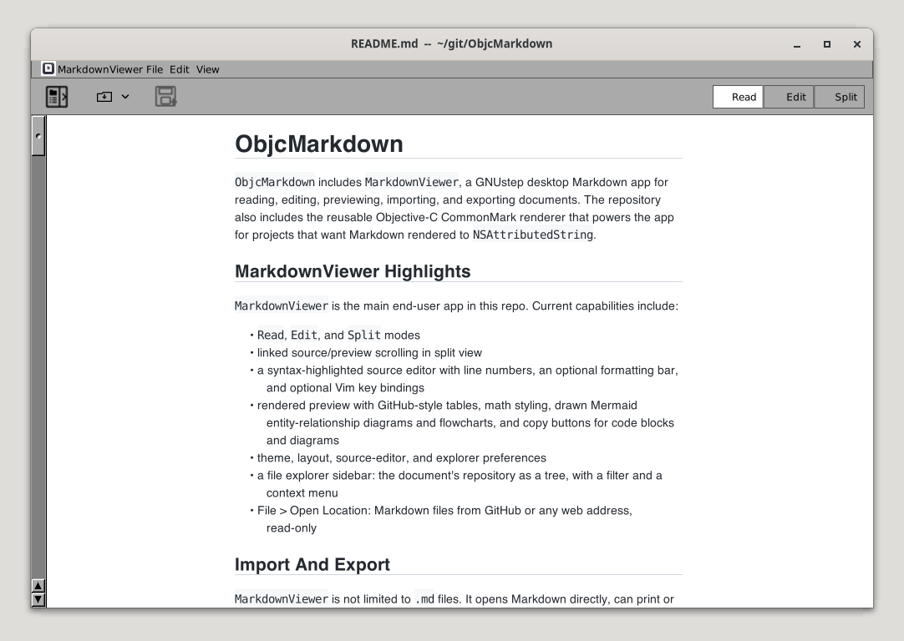
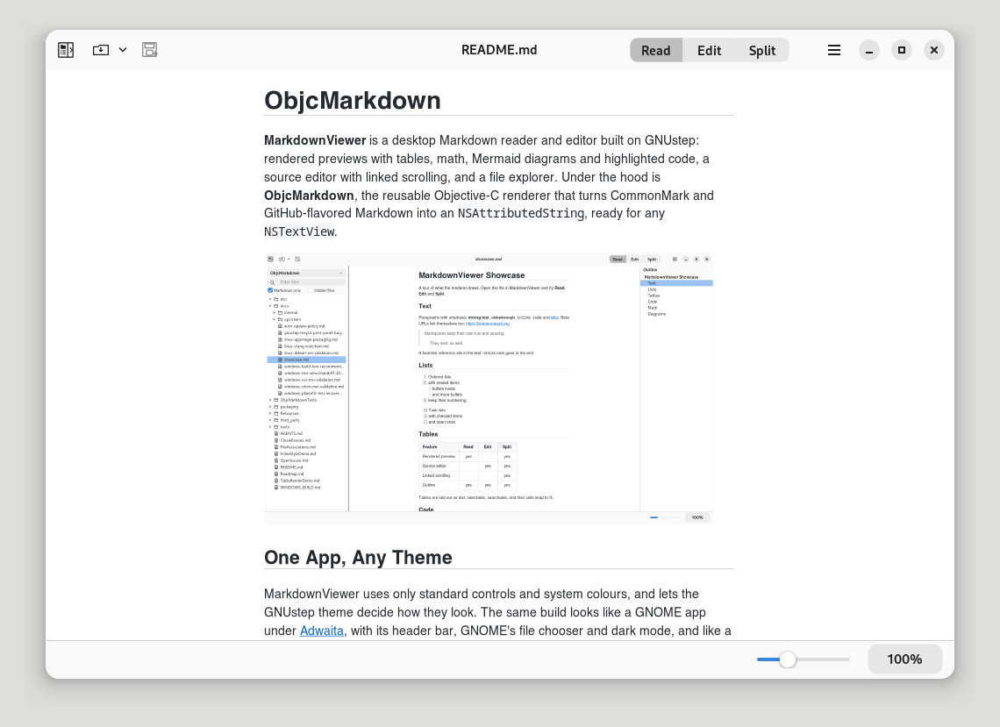
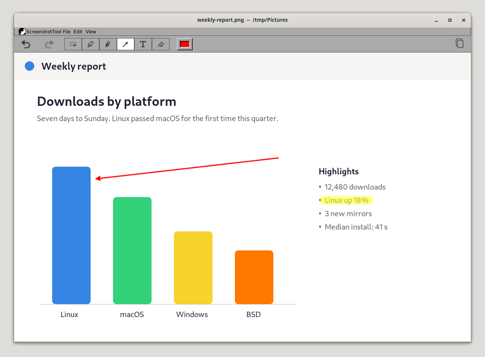
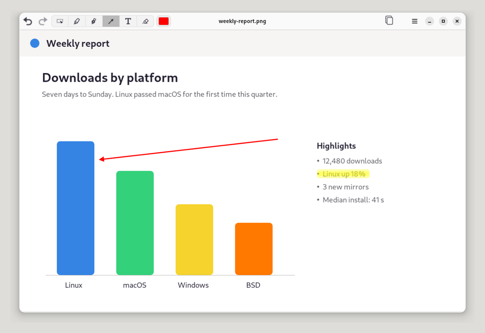
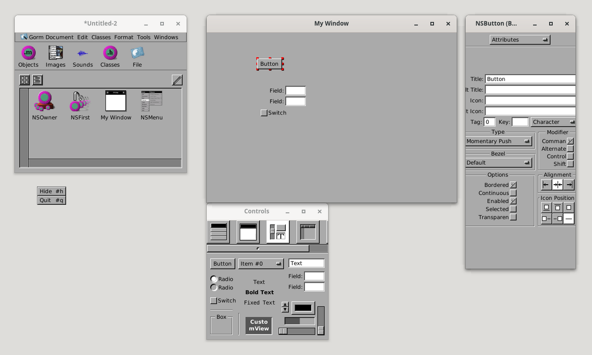
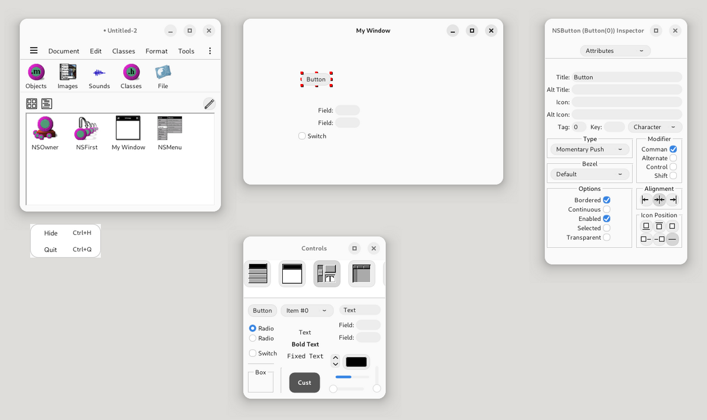
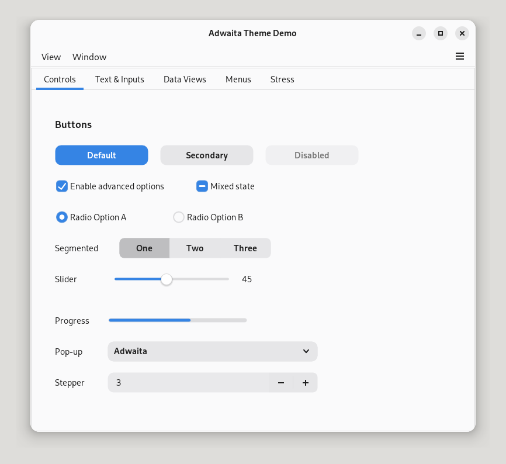
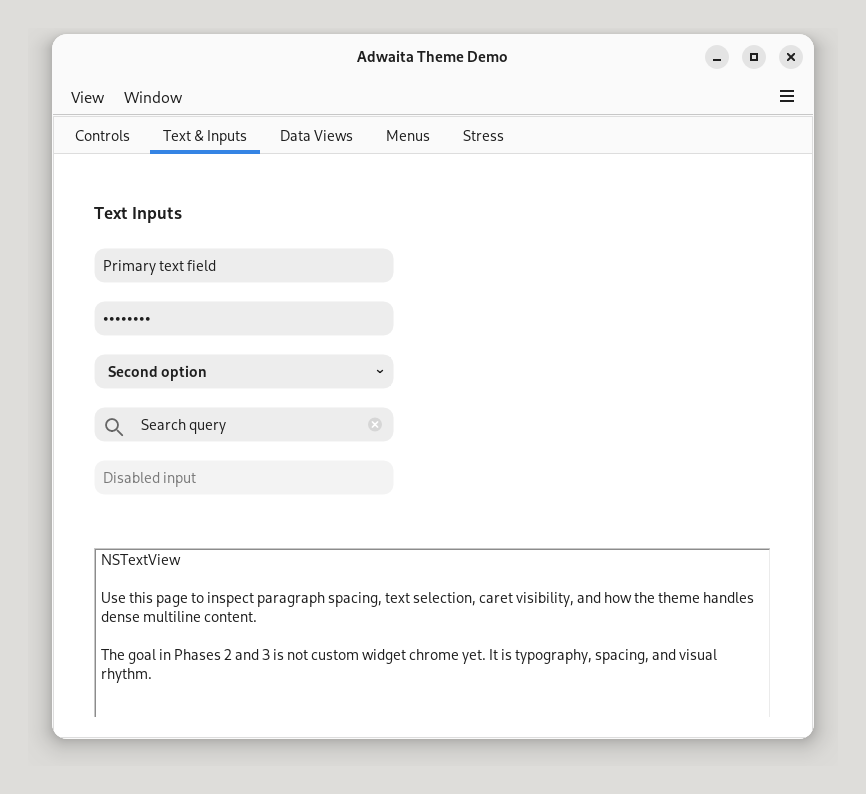
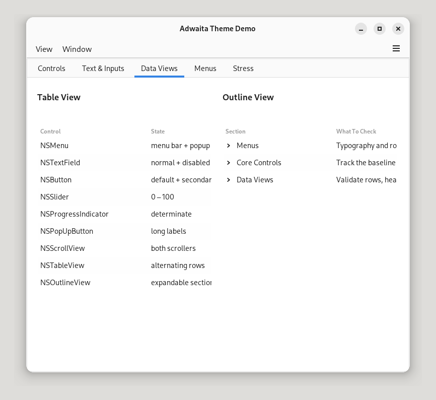

# GNUstep Adwaita Theme

`plugins-themes-adwaita` is an Adwaita-targeted theme plugin for GNUstep.

The goal is pragmatic rather than literal pixel-perfect GTK emulation: make
GNUstep applications feel at home on a modern GNOME desktop while staying
inside the GNUstep theme layer wherever possible.

The current priority is forward-looking GNOME integration, not strict backward
compatibility with the appearance of existing GNUstep applications. The main
use case today is making it possible to build new GNUstep apps that feel at
home on GNOME. Backward-compatibility improvements may still happen later, but
they are not the primary design constraint for this release.

## GNUstep's theme and Adwaita, side by side

The same apps, the same windows, left with GNUstep's default theme and right
with this one:

<table>
  <tr>
    <th width="50%">GNUstep theme</th>
    <th width="50%">Adwaita</th>
  </tr>
  <tr>
    <td></td>
    <td></td>
  </tr>
  <tr>
    <td colspan="2" align="center"><a href="https://github.com/danjboyd/ObjcMarkdown">MarkdownViewer</a></td>
  </tr>
  <tr>
    <td></td>
    <td></td>
  </tr>
  <tr>
    <td colspan="2" align="center"><a href="https://github.com/danjboyd/ScreenshotTool">ScreenshotTool</a></td>
  </tr>
  <tr>
    <td></td>
    <td></td>
  </tr>
  <tr>
    <td colspan="2" align="center">Gorm, GNUstep's interface builder (its windows come from Gorm files, so it runs with compact metrics)</td>
  </tr>
</table>

What changes: libadwaita's header bar, with the window's toolbar in it and
GNOME's window buttons; its buttons, entries, switches, check boxes and
pop-ups; menus as popovers with the primary ☰ menu; overlay scrollbars;
GNOME's fonts, dark style and high contrast; GNOME's file chooser for open
and save panels. All taken on GNOME Shell 48 (X11) with libs-gui and
libs-back built with the patches below; how each shot was made is in
[`Docs/Screenshots/README.md`](Docs/Screenshots/README.md).

## Status and requirements

The theme as it stands relies on **GNUstep patches that are not upstream
yet** (see [`Docs/upstream-patches/README.md`](Docs/upstream-patches/README.md)):

- **libs-back:** window manager functions for windows GNUstep decorates
  (sent as [libs-back#244](https://github.com/gnustep/libs-back/pull/244)),
  GTK's window types for menus, tool tips and dialogs, an alpha channel for
  borderless windows, and GNOME's window shadow, rounded corners and popover
  shadow.
- **libs-gui:** letting a theme turn on GNUstep-drawn window decorations,
  which is how the header bar becomes the default.

Until they are released, build libs-gui and libs-back with the patches in
`Docs/upstream-patches/`. With stock GNUstep 0.32 the theme still works, but
the header bar has to be turned on by hand ([below](#header-bar)), and
windows, menus and tool tips have square corners and no shadow.

## Controls reference

<p>
  
  
  
</p>

## Release status

This project should currently be treated as an `0.1.0-alpha5` release.

What is already in place:

- Adwaita-inspired palette, spacing, and control rendering for core widgets
- A GNUstep demo app for side-by-side inspection
- A GTK4/libadwaita reference app for comparison
- GNOME settings integration for fonts and appearance variants

What is still known to be incomplete:

- text-field focus/render parity is not fully resolved yet
- some popup/combo-box interaction details still need manual polish
- visual acceptance is still partly manual rather than fully scripted

## Known Issues

- Focusing a text field can still cause a subtle text rendering change compared
  to the unfocused state.
- Combo-box and popup-menu interaction chrome is substantially improved, but a
  few interaction details still need final polish against the GTK reference.
- The project still relies on manual side-by-side visual review for some
  acceptance decisions.

## Scope

This theme targets stock Adwaita as the visual baseline for GNUstep on GNOME.

It does not currently aim to:

- support arbitrary third-party GTK themes
- reproduce GTK4's rendering architecture
- patch `libs-gui` unless a clear framework blocker remains after theme work
- guarantee that existing GNUstep applications will preserve their prior look
  unchanged under this theme

## Repository Layout

```text
Source/                  Theme implementation
Resources/               Theme bundle metadata and assets
Examples/ThemeDemo/      GNUstep-side demo app
Reference/AdwaitaDemo/   GTK4/libadwaita comparison harness
Reference/HeaderBar/     libadwaita header bar measurements and renders
Tests/Scripts/           Capture and local verification helpers
Docs/                    Public design notes and roadmap; releasing in Docs/RELEASING.md
Tools/                   Release helpers
```

## Requirements

Build requirements for the GNUstep theme bundle:

- GNUstep make and GNUstep GUI development environment
- `pkg-config`
- `gio-2.0`
- `glib-2.0`
- `gobject-2.0`

Reference app requirements:

- Python 3
- PyGObject
- GTK4
- libadwaita

## Build

```sh
make
make -C Examples/ThemeDemo
```

Install the theme for the current user:

```sh
make install GNUSTEP_INSTALLATION_DOMAIN=USER
```

The installed theme bundle will be placed under:

```text
~/GNUstep/Library/Themes/Adwaita.theme
```

## Run

Launch the GNUstep demo app with the Adwaita theme selected:

```sh
PATH=/usr/GNUstep/System/Tools:$PATH defaults write ThemeDemo GSTheme Adwaita
bash Tests/Scripts/run-theme-demo.sh
```

Launch the GTK reference app:

```sh
python3 Reference/AdwaitaDemo/adwaita_demo.py
```

Open a specific page in the reference app:

```sh
python3 Reference/AdwaitaDemo/adwaita_demo.py --page controls
python3 Reference/AdwaitaDemo/adwaita_demo.py --page data
python3 Reference/AdwaitaDemo/adwaita_demo.py --page text
```

## Settings

The theme reads these from the user's defaults for an app
(`defaults write APP KEY VALUE`, or `-KEY VALUE` on the command line), then
from the app's own Info.plist (`GnomeThemeMetrics`, `GnomeThemeMenuStyle`
and `GnomeThemeHeaderBarToolbar`, so an app can declare how it was
designed):

- `GnomeThemeMetrics`: `gnome` or `compact`. Apps whose windows are built in
  code get GNOME's metrics: the interface font at GNOME's size (11pt at
  96dpi, about 14.7px), bold button titles, libadwaita's button padding and
  tab height. Apps with a main Gorm or nib file (`NSMainNibFile`,
  `NSMainStoryboardFile` or `GSMainMarkupFile` in their Info.plist) get
  `compact` metrics instead: GNUstep's 12pt, regular-weight button titles,
  GNUstep's button margins and tab height, so layouts made at those metrics
  fit. In an app built in code, the windows it loads from Gorm or nib files
  (its own, or libs-gui's panels) get compact metrics of their own: their
  controls' text at GNUstep's size and GNUstep's margins, indicators and tab
  height, while its other windows, its menus and its fonts keep GNOME's.
  Set `gnome` or `compact` to give every window the same; `auto` is the
  same as not setting it. A code-built app whose Gorm files were laid out
  for GNOME's metrics (with the Adwaita palette below) sets `gnome`.
- `GnomeThemeMenuStyle`: `menubar` (the default) or `primary`. With
  `primary` the menu bar becomes GNOME's main menu button (☰): at the end of
  the window's toolbar when it shows one, otherwise alone in a slim bar.
  Clicking it shows the app's menus, then its application menu's items
  (Preferences, About, Quit), as GNOME's primary menu lists them. The menu
  itself is unchanged, so key equivalents and validation work as before.
- `GnomeThemeHeaderBarToolbar`: `YES` puts the window's toolbar in the
  header bar's row, as a GNOME app packs its buttons there, instead of a
  row of its own (only with the header bar, below). Items before the
  toolbar's flexible space go at the bar's start, items after it at its
  end, and the title in the space; icons are shown without labels, and an
  item without an icon is a text button. Items that don't fit go into the
  toolbar's » menu; in right-to-left languages the bar is mirrored. Off by
  default: the toolbar has to suit it (a few icons, a flexible space).
  A user can turn it on for every app at once with
  `defaults write NSGlobalDomain GnomeThemeHeaderBarToolbar YES`; a setting
  for one app still wins, and an app whose Info.plist says `NO` (its
  toolbar doesn't suit the bar) keeps its own row. A change applies to open
  windows, which keep their size: the content gives up or takes the
  toolbar's row. Apps don't need to set their toolbars again.
- `GnomeFontScale`: a factor (0.8–2.0) applied to the interface font.

Scrollbars are GNOME's overlay scrollbars while GNOME's `overlay-scrolling`
setting is on (its default): the content runs under them, and they show
only while it scrolls or the pointer is over them (wider then), fading out
a second later. `GnomeThemeOverlayScrollbars NO` (for an app, or in
`NSGlobalDomain`) keeps classic scrollbars, beside the content and shown
while it overflows.

Open and save panels are GNOME's file chooser, asked for through the XDG
desktop portal (`org.freedesktop.portal.FileChooser`) and attached to the
app's window, as a GTK or Flatpak app's are. An app needs no change, and
needs no library such as libs-OpenSave. A panel stays GNUstep's own when it
has an accessory view (other than NSDocument's "File Type" pop-up, whose
types become the chooser's filters), when its delegate filters or
validates names, or when there is no portal.
`GnomeThemeNativeFileDialogs NO` (for an app, or in `NSGlobalDomain`) keeps
GNUstep's panels. The chooser picks files or folders, not both: an open
panel that allows both (GNUstep's default) picks files. Like GNUstep's
panels, sheets block until the chooser closes; meanwhile the app redraws
but takes no input.

High contrast follows GNOME's accessibility setting
(`org.gnome.desktop.a11y.interface high-contrast`), as libadwaita does: the
light or dark palette with stronger borders and separators. GNOME 3's
`HighContrast` and `HighContrastInverse` themes still turn it on.

### Symbolic icons

A template image is drawn in the colour of the text around it, as GTK
draws symbolic icons: the button's or menu's text colour, the header bar's
(dimmed while the window isn't focused), the title colour on a suggested
(default) button, and the disabled text colour. An app can ship one
monochrome icon set, drawn in any colour (only its shape is used), and it
follows the light, dark and high contrast palettes. An image is a template
when `-[NSImage isTemplate]` says so (libs-gui after 0.32), or when its
name ends in `Template` (Cocoa's convention) or `-symbolic` (GNOME's), for
example `[NSImage imageNamed: @"zoom-in-symbolic"]`.

### Inline button rows in menus

GNOME apps put a row of buttons in a menu, such as the "- 100% +" zoom row
(GTK's `horizontal-buttons` menu sections). To get one, give consecutive
menu items the same string as their `representedObject`, starting with
`GnomeThemeInlineGroup:`:

```objc
[zoomOut setRepresentedObject: @"GnomeThemeInlineGroup:zoom"];
[actualSize setRepresentedObject: @"GnomeThemeInlineGroup:zoom"];  /* "110%" */
[zoomIn setRepresentedObject: @"GnomeThemeInlineGroup:zoom"];
```

The theme shows them as one row of flat buttons: each item's image
(symbolic images take the text colour, see above), or its title when it
has none, with the items between the first and the last taking the
spare room. They stay ordinary items, with their actions, key
equivalents and validation; under other themes they show as a plain
list. Two items or more make a row.

### Windows without the menu bar

GNOME apps keep their menus in the main window. The theme leaves the menu
bar (or ☰) out of a window titled "Preferences" or "Settings" (with or
without "…"), unless it is the app's only window that can become main. An
app decides for itself by giving the window a delegate that implements:

```objc
- (BOOL) windowShouldShowMenuBar: (NSWindow *)window;
```

Its answer wins over the title, both ways, so this also covers other
auxiliary windows and titles in other languages. Key equivalents still
work in a window without the menu bar: GNUstep sends them to the main menu.

### Header bar

By default GNUstep draws the window decorations instead of the window
manager, and this theme draws them as libadwaita's header bar: one 46pt
row with the bold title centred, round window buttons in the order of GNOME's `button-layout`, and
the primary menu's ☰ before them. Drag the bar to move the window; resize
from any edge or corner; double-click the bar for GNOME's
`action-double-click-titlebar` action (maximise by default); right-click it
for the window menu. On X11 (GNUstep apps on GNOME run under Xwayland) the
window manager does the moving, resizing and maximising, as for GTK's
windows: under Mutter that brings snapping, tiling, dragging past the
screen's edge, Super-drag and Mutter's own window menu. Without a window
manager that supports it, the header bar does these itself. It follows the
scale factor (`GSScaleFactor`), mirrors in right-to-left languages, and has
libadwaita's high contrast details. Alerts have no bar, as GNOME's.

The theme asks for this in its `GSThemeDomain`
(`GSBackHandlesWindowDecorations = NO`). GNUstep's backend reads that
setting before any theme loads, so it takes a libs-gui that looks it up in
the theme first: a libs-gui with the patch in
`Docs/upstream-patches/libs-gui/`. With a stock libs-gui, turn the header
bar on yourself:

```
defaults write NSGlobalDomain GSX11HandlesWindowDecorations NO
```

To keep the window manager's title bar instead, for all apps or for one
(by its defaults domain, here TextEdit's):

```
defaults write NSGlobalDomain GSBackHandlesWindowDecorations YES
defaults write TextEdit GSBackHandlesWindowDecorations YES
```

A user's `GSBackHandlesWindowDecorations` or `GSX11HandlesWindowDecorations`
always wins over the theme's.

With `GnomeThemeHeaderBarToolbar` (above) the window's toolbar goes in the
bar's row.

The window's shadow, its rounded corners and resizing from the shadow, and
rounded, translucent menus and tool tips under a compositor, need a
libs-back with the patches in `Docs/upstream-patches/` (see its README and
`Docs/PROPOSAL_LIBS_BACK_CSD.md`).

`make check-mutter` checks the header bar with Mutter as the window manager:
GNOME Shell on a private Xvfb display, with its own D-Bus session and no
gvfs (see `Tests/Scripts/run-mutter-check.sh`).

### Designing a GNOME-style app in Gorm

Gorm itself runs with compact metrics (its own windows come from Gorm files
laid out at GNUstep's). An app meant to look like a GNOME app needs its
windows laid out at GNOME's metrics instead:

1. Declare it in the app's Info.plist, so it runs with GNOME's metrics even
   though it has a main Gorm file (and, if you like, the primary menu):

   ```
   GnomeThemeMetrics = gnome;
   GnomeThemeMenuStyle = primary;
   ```

   With GNUstep Make, put these in `APPNAMEInfo.plist` next to the makefile.
2. Install the Adwaita palette: controls at GNOME's sizes (34pt buttons,
   entries, pop-ups and search fields, a suggested button, checkboxes,
   radios, heading and body labels). Gorm's own palettes make 22pt controls.

   ```sh
   make palette installpalette GNUSTEP_INSTALLATION_DOMAIN=USER
   defaults write Gorm UserPalettes \
     '("'$HOME'/GNUstep/Library/ApplicationSupport/Palettes/Adwaita.palette")'
   ```

   (or open it once with Palettes ▸ Open… in Gorm's Tools menu, which
   remembers it). It appears as the last icon in Gorm's palette panel.
3. Lay its windows out in Gorm running with GNOME's metrics, so what you see
   is what the app will show:

   ```sh
   openapp Gorm -GnomeThemeMetrics gnome
   ```

   Gorm's own inspectors are cramped at this size (some labels clip), but the
   document's windows show the app's real text and control sizes. Size push
   buttons and text fields 34pt high, and leave GNOME's spacing: 6pt between
   related controls, 12pt between groups, 18pt from the window's edge.
4. Leave control fonts at the system font's default size (Gorm's default,
   and the palette's). Those are archived as "the system font" and follow
   the metrics the app runs with; a font given an explicit size keeps it.

## Development Notes

The fastest practical review loop is:

```sh
make
make -C Examples/ThemeDemo
bash Tests/Scripts/run-theme-demo.sh --page controls
make check-quirks
```

The demo and capture scripts load the theme bundle built in this checkout
(`Adwaita.theme`, by absolute path), not the installed copy: `-GSTheme Adwaita`
finds `~/GNUstep/Library/Themes/Adwaita.theme`, which may be older. Pass
`--theme PATH` (or set `ADWAITA_THEME`) to check another build. Install for
other apps with `make install GNUSTEP_INSTALLATION_DOMAIN=USER`.

`make check-quirks` runs `Tests/Scripts/run-quirk-probe.sh`: it builds
`Examples/QuirkProbe` and runs it on a private Xvfb display against the built
theme. The probe renders controls offscreen and measures them (sized button and
checkbox titles, wrapping labels and alert text, toolbar image items, the bold
font, the menu bar in a window created after launch, table grid lines,
frames and headers, the menu bar's app item, toolbar edges and hover,
pop-up titles, and the size of hidden tool tip and drag windows), prints one
PASS/FAIL/KNOWN/SKIP line per check, and exits with the number of failures.
KNOWN marks a GNUstep bug the theme can't fix (see `Docs/upstream-issues/`).
Add `--output DIR` to save a PNG of each probe window. `make check-quirks`
runs the probe seven times: with the menu bar and with the primary menu
(`QUIRK_PROBE_ARGS="-GnomeThemeMenuStyle primary"`), each with the window
manager's title bar and with the theme's header bar
(`-GSX11HandlesWindowDecorations NO`), then the header bar's checks alone in
the dark palette and in high contrast over the light and the dark palette
(`QUIRK_PROBE_STYLE=dark`, `high-contrast` or `high-contrast-dark` with
`-ProbeOnly header-bar`). The probe sets the decoration
flag itself, so a user default doesn't change the runs.

Useful helpers:

- `bash Tests/Scripts/run-theme-demo.sh`
- `bash Tests/Scripts/run-quirk-probe.sh --output /tmp/quirk-probe`
- `bash Tests/Scripts/run-adwaita-demo.sh`
- `bash Tests/Scripts/capture-theme-demo.sh --page controls --output /tmp/theme-controls.png`
- `bash Tests/Scripts/capture-adwaita-demo.sh --page controls --output /tmp/adwaita-controls.png`
- `python3 Reference/AdwaitaDemo/adwaita_demo.py --dump-metrics`
- `python3 Tests/Scripts/import-adwaita-cursors.py`

`import-adwaita-cursors.py` imports the stock Adwaita diagonal resize Xcursor
assets from `/usr/share/icons/Adwaita/cursors` and writes GNUstep-loadable TIFF
resources into `Resources/ThemeImages`. These resources provide
`GSFrameResizeNWSECursor` and `GSFrameResizeNESWCursor` for Cocoa-style apps
that need frame/corner resize cursors before GNUstep exposes AppKit's
`NSCursor` frame-resize API directly.

ThemeDemo also accepts command automation for focused visual checks:

```sh
Examples/ThemeDemo/ThemeDemo.app/ThemeDemo --command-script /tmp/theme-demo.commands
Examples/ThemeDemo/ThemeDemo.app/ThemeDemo --command-fifo /tmp/theme-demo.fifo
python3 Reference/AdwaitaDemo/adwaita_demo.py --command-script /tmp/adwaita-demo.commands
python3 Reference/AdwaitaDemo/adwaita_demo.py --command-fifo /tmp/adwaita-demo.fifo
```

Supported commands are `page NAME`, `click X Y`, `focus NAME`, `blur-to NAME`,
`select-all`, `open-dropdown NAME`, `type TEXT`, `key TEXT`, `wait SECONDS`,
`display`, `screenshot PATH`, `screenshot-screen PATH`,
`capture-dropdown NAME PATH`, `capture-alert PATH`, and `quit`. Text audit names
are `primary`, `password`, `search`, `disabled`, `body`, and `combo`.
Coordinates are backing-pixel positions from the top-left of the internally
captured content image, so they line up with screenshots produced by
`screenshot PATH`. Use `screenshot-screen PATH` when auditing popups or dropdowns
that render outside the application content view; it uses GNUstep screen capture
first and falls back to `gnome-screenshot` only if needed. Use
`capture-dropdown NAME PATH` for GNUstep combo boxes whose popup tracking is
modal; it schedules the same internal screen capture while the popup is open.
Use `capture-alert PATH` to audit a stock document-close `NSAlert`.

## Internal Notes

If local-only working notes are needed, keep them under `.internal/`.

That directory is ignored on purpose so internal handoff notes, private paths,
and local debug artifacts do not show up in a public GitHub repository.

## License

This project is licensed under the GNU Lesser General Public License, either
version 2 of the License, or (at your option) any later version.

See [COPYING.LIB](./COPYING.LIB).

## Current Ownership

- Author: Daniel Boyd
